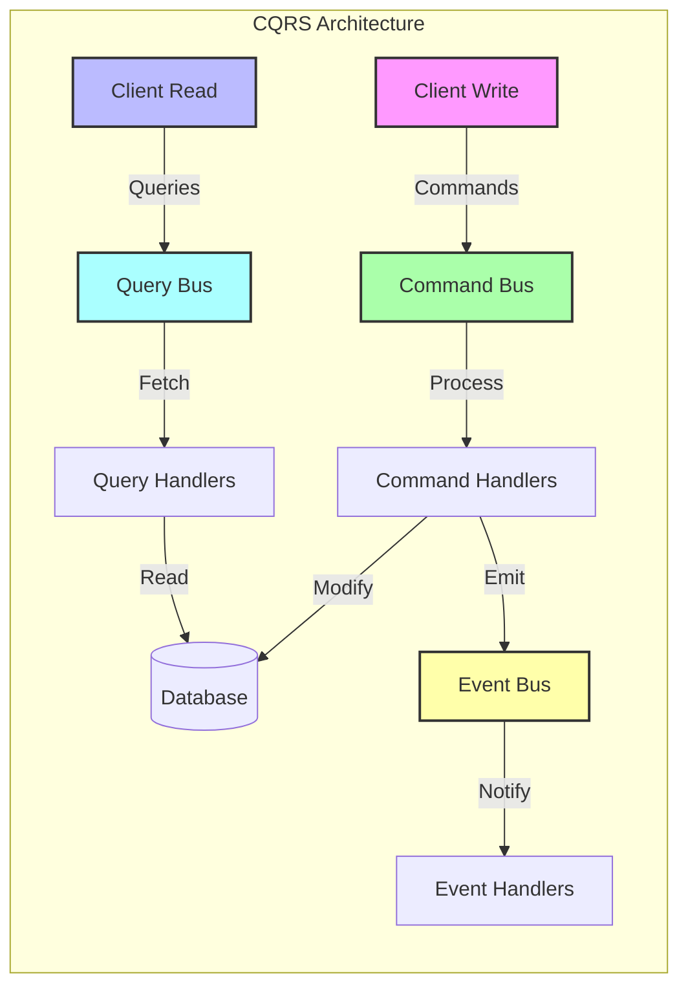
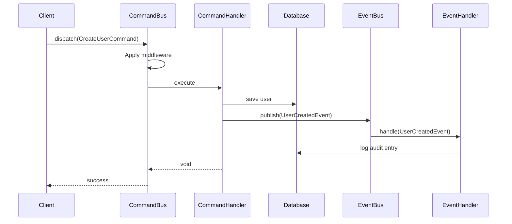
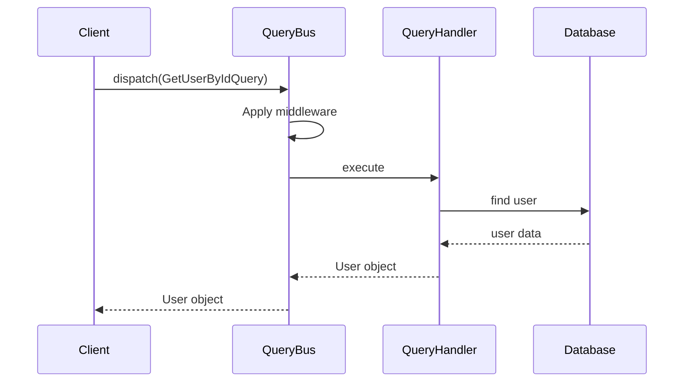

ODY CQRS provides a clean separation between commands (which modify state) and queries (which retrieve data), enabling
scalable and maintainable application architecture.

Key features:

- **Command Bus**: Process state-changing operations
- **Query Bus**: Handle data retrieval operations
- **Event Bus**: Broadcast and handle domain events
- **Middleware Support**: Extend functionality with custom middleware
- **Attribute-based Registration**: Simple handler declaration with PHP 8 attributes

## Installation

```bash
composer require ody/cqrs
```

## Introduction

Command Query Responsibility Segregation is an architectural pattern that separates read operations (Queries) from write operations (Commands). This separation allows for specialized optimization of each path, increased scalability, and better maintainability of your codebase.



### Messages

At the heart of the CQRS system are three types of messages:

* **Commands**: Represent intentions to change state (e.g., `CreateUserCommand`, `UpdateProductCommand`)
* **Queries**: Represent requests for information without side effects (e.g., `GetUserByIdQuery`, `ListProductsQuery`)
* **Events**: Represent notifications that something has happened (e.g., `UserCreatedEvent`, `OrderShippedEvent`)

Messages in this implementation are simple PHP objects, intentionally free from framework-specific dependencies. This design choice keeps your domain logic clean and portable.

### Handlers

For each message type, there are corresponding handlers:

* **Command Handlers**: Process commands and modify state
* **Query Handlers**: Process queries and return data
* **Event Handlers**: React to events (and multiple handlers can respond to a single event)

Handlers are services available in the dependency container. Using PHP 8 attributes, you can easily mark methods as handlers:

```php
#[CommandHandler]
public function createUser(CreateUserCommand $command, EventBusInterface $eventBus)
{
    // Process command logic...
    $eventBus->publish(new UserCreatedEvent($userId));
}

#[QueryHandler]
public function getUserById(GetUserByIdQuery $query)
{
    // Retrieve and return data...
}

#[EventHandler]
public function notifyOnUserCreated(UserCreatedEvent $event)
{
    // React to event...
}
```

### Message Buses

Message buses serve as the transport mechanism that connects messages to their handlers:

* **Command Bus**: Routes commands to their respective command handlers
* **Query Bus**: Routes queries to their respective query handlers and returns results
* **Event Bus**: Distributes events to all registered event handlers

### How Does It All Fit Together?

When a command is dispatched through the Command Bus:

1. The bus identifies the appropriate handler based on the command's class
2. Middleware components may intercept the command for cross-cutting concerns
3. The handler processes the command, potentially emitting events
4. Events are published to the Event Bus, triggering any relevant event handlers

Command flow:



Query flow:



## Configuration

Create or update `config/cqrs.php`:

```php
<?php
return [
    // Paths to scan for handlers
    'handler_paths' => [
        app_path('Services'),
    ],
    // Paths to scan for middleware
    'middleware_paths' => [
        app_path('Middleware'),
    ],
    'middleware' => [
        // Global middleware applied to all buses
        'global' => [
            // Example: App\Middleware\LoggingMiddleware::class,
        ],
        // Command bus specific middleware
        'command' => [
            // Example: App\Middleware\TransactionalMiddleware::class,
        ],
        // Query bus specific middleware
        'query' => [
            // Example: App\Middleware\CachingMiddleware::class,
        ],
        // Event bus specific middleware
        'event' => [
            // Example: App\Middleware\AsyncEventMiddleware::class,
        ],
    ],
];
```

## Usage

### Define Commands, Queries, and Events

All Messages (Command/Queries/Events) just like Message Handlers (Command/Query/Event Handlers) are simple Plain old 
PHP Objects which means they do not extend or implement any framework specific classes.
This way we keep our business code clean and easy to understand.

```php
<?php
// Command to modify state
namespace App\Commands;

use Ody\CQRS\Message\Command;

class CreateUserCommand extends Command
{
    public function __construct(
        public string $name,
        public string $email,
        public string $password
    ) {}
}

// Query to retrieve data
namespace App\Queries;

use Ody\CQRS\Message\Query;

class GetUserById extends Query
{
    public function __construct(
        public string $id
    ) {}
}

// Event to notify about domain changes
namespace App\Events;

use Ody\CQRS\Message\Event;

class UserWasCreated extends Event
{
    public function __construct(
        public string $id
    ) {}
}
```

### Create Handlers

Command/Queries/Events handlers are Services available in Dependency Container, which are defined to handle Commands.

```php
<?php
namespace App\Services;

use App\Commands\CreateUserCommand;
use App\Events\UserWasCreated;
use App\Models\User;
use App\Queries\GetUserById;
use Ody\CQRS\Attributes\CommandHandler;
use Ody\CQRS\Attributes\EventHandler;
use Ody\CQRS\Attributes\QueryHandler;
use Ody\CQRS\Interfaces\EventBusInterface;

class UserService
{
    #[CommandHandler]
    public function createUser(CreateUserCommand $command, EventBusInterface $eventBus): void
    {
        $user = User::create([
            'name' => $command->name,
            'email' => $command->email,
            'password' => $command->password,
        ]);

        $eventBus->publish(new UserWasCreated($user->id));
    }

    #[QueryHandler]
    public function getUserById(GetUserById $query): User
    {
        return User::findOrFail($query->id);
    }

    #[EventHandler]
    public function onUserCreated(UserWasCreated $event): void
    {
        logger()->info("User was created: " . $event->id);
    }
}
```

### Dispatch

```php
<?php
namespace App\Controllers;

use App\Commands\CreateUserCommand;
use App\Queries\GetUserById;
use Ody\CQRS\Interfaces\CommandBusInterface;
use Ody\CQRS\Interfaces\QueryBusInterface;
use Psr\Http\Message\ResponseInterface;
use Psr\Http\Message\ServerRequestInterface;

class UserController
{
    public function __construct(
        private readonly CommandBusInterface $commandBus,
        private readonly QueryBusInterface   $queryBus
    ) {}

    public function createUser(ServerRequestInterface $request, ResponseInterface $response): ResponseInterface
    {
        $data = $request->getParsedBody();
        $this->commandBus->dispatch(
            new CreateUserCommand(
                name: $data['name'],
                email: $data['email'],
                password: $data['password']
            )
        );

        return $response->withStatus(201)
            ->withHeader('Content-Type', 'application/json')
            ->withBody(json_encode(['status' => 'success']));
    }

    public function getUser(ServerRequestInterface $request, ResponseInterface $response, array $args): ResponseInterface
    {
        $user = $this->queryBus->dispatch(
            new GetUserById(
                id: $args['id']
            )
        );

        return $response->withStatus(200)
            ->withHeader('Content-Type', 'application/json')
            ->withBody(json_encode($user));
    }
}
```

## Middleware System

The CQRS middleware system allows you to intercept and modify the behavior of commands, queries, and events at various points in their lifecycle.

### Types of Middleware

1. **Before**: Executes before the target method is called
2. **Around**: Wraps the execution of the target method
3. **After**: Executes after the target method returns successfully
4. **AfterThrowing**: Executes when the target method throws an exception

### Example: Logging Middleware

```php
<?php
namespace App\Middleware;

use Ody\CQRS\Middleware\Before;
use Ody\CQRS\Middleware\After;
use Ody\CQRS\Middleware\AfterThrowing;

class LoggingMiddleware
{
    #[Before(pointcut: "Ody\\CQRS\\Bus\\CommandBus::executeHandler")]
    public function logBeforeCommand(object $command): void
    {
        logger()->info('Processing command: ' . get_class($command));
    }

    #[After(pointcut: "Ody\\CQRS\\Bus\\QueryBus::executeHandler")]
    public function logAfterQuery(mixed $result, array $args): mixed
    {
        $query = $args[0] ?? null;
        
        if ($query) {
            logger()->info('Query processed: ' . get_class($query));
        }
        
        return $result;
    }

    #[AfterThrowing(pointcut: "Ody\\CQRS\\Bus\\EventBus::executeHandlers")]
    public function logEventException(\Throwable $exception, array $args): void
    {
        $event = $args[0] ?? null;
        
        if ($event) {
            logger()->error('Error handling event: ' . get_class($event));
        }
    }
}
```

### Pointcut Expressions

Pointcut expressions determine which methods the middleware applies to. The syntax supports:

1. **Exact Class Match**: `App\Services\UserService`
2. **Namespace Wildcard**: `App\Domain\*`
3. **Method Match**: `App\Services\UserService::createUser`
4. **Any Method Wildcard**: `App\Services\UserService::*`
5. **Global Wildcard**: `*` (matches everything)
6. **Logical Operations**: `App\Domain\* && !App\Domain\Internal\*`

### Example: Transactional Middleware

```php
<?php
namespace App\Middleware;

use Ody\CQRS\Middleware\Around;
use Ody\CQRS\Middleware\MethodInvocation;

class TransactionalMiddleware
{
    public function __construct(private \PDO $connection)
    {
    }

    #[Around(pointcut: "Ody\\CQRS\\Bus\\CommandBus::executeHandler")]
    public function transactional(MethodInvocation $invocation): mixed
    {
        $this->connection->beginTransaction();
        
        try {
            $result = $invocation->proceed();
            $this->connection->commit();
            return $result;
        } catch (\Throwable $exception) {
            $this->connection->rollBack();
            throw $exception;
        }
    }
}
```

## API Integration

The CQRS module can be easily integrated with your API layer to expose commands and queries as RESTful endpoints.

### Add API Metadata to Commands and Queries

```php
<?php
use Ody\CQRS\Api\Documentation\ApiEndpoint;
use Ody\CQRS\Message\Command;

#[ApiEndpoint(
    path: '/api/users',
    method: 'POST',
    summary: 'Create a new user',
    description: 'Creates a new user with the provided information',
    tags: ['users']
)]
class CreateUserCommand extends Command
{
    public function __construct(
        public string $name,
        public string $email,
        public string $password
    ) {}
}
```

### Create API Controllers

```php
<?php
use Ody\CQRS\Api\CqrsController;
use Psr\Http\Message\ResponseInterface;
use Psr\Http\Message\ServerRequestInterface;

class UserController extends CqrsController
{
    public function createUser(ServerRequestInterface $request): ResponseInterface
    {
        return $this->command(CreateUserCommand::class, $request);
    }
    
    public function getUser(ServerRequestInterface $request): ResponseInterface
    {
        return $this->query(GetUserByIdQuery::class, $request);
    }
}
```

### Set Up Middleware

```php
<?php
use Ody\CQRS\Api\CqrsApiAdapter;
use Ody\CQRS\Api\Middleware\RequestMappingMiddleware;
use Ody\CQRS\Api\Middleware\ResponseFormattingMiddleware;
use Ody\CQRS\Api\Middleware\RequestMappingConfigFactory;

// Create the CQRS adapter
$cqrsAdapter = new CqrsApiAdapter($commandBus, $queryBus);

// Create route mapping configuration
$configFactory = new RequestMappingConfigFactory();
$config = $configFactory
    ->mapPostToCommand('/api/users', CreateUserCommand::class)
    ->mapGetToQuery('/api/users/{id}', GetUserByIdQuery::class)
    ->getConfig();

// Create middleware
$requestMappingMiddleware = new RequestMappingMiddleware($cqrsAdapter, $config);
$responseFormattingMiddleware = new ResponseFormattingMiddleware($response);

// Add middleware to your application
$app->add($responseFormattingMiddleware);
$app->add($requestMappingMiddleware);
```
